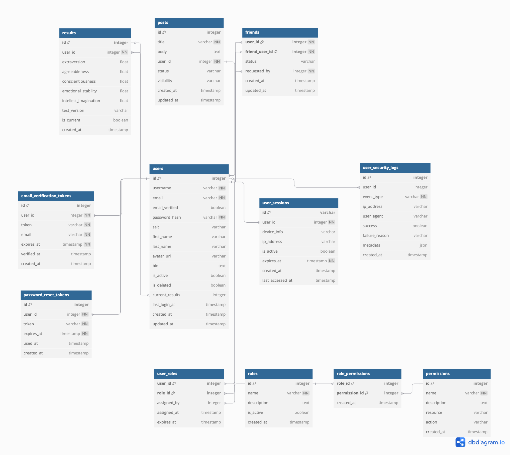

# COP4813 Semester Project 
# Friend Finder

- [COP4813 Semester Project](#cop4813-semester-project)
- [Friend Finder](#friend-finder)
  - [Prod Build](#prod-build)
    - [Script](#script)
  - [Dev Build](#dev-build)
  - [Architecture](#architecture)
    - [1. Docker](#1-docker)
    - [2. Config](#2-config)
    - [3. Service Manager](#3-service-manager)
    - [4. Database](#4-database)
    - [5. Server](#5-server)
    - [6. Frontend](#6-frontend)

## Prod Build

### Script
```sh
./build_friendfinder.sh
```

## Dev Build

1. Build React Frontend
```sh
cd frontend
npm install
npm run build
```

2. Start server
```sh
python3 -m venv venv
source venv/bin/activate
pip install -r requirements.txt
python3 server.py
```

## Architecture

### 1. Docker
The entire server, database, and service manager are all containerized within a docker container. Since we are currently self-hosting via Cloudflare tunnel, we wanted the ability to quickly pivit to a cloud service if needed. Docker also provides an easily reproducible environment for testing production builds.

- **Image**: `Ubuntu 22.04 LTS`

### 2. Config
The config is constants that are needed to load the program to the same state on each start up.

**Example Config**
```yml
server:
  port: "8000"
  python_path: "python3"
  script_path: "server.py"
  read_timeout: 30s
  write_timeout: 30s
  idle_timeout: 60s

database:
  host: "localhost"
  port: 5432
  user: ""
  password: ""
  db_name: "friend_finder"
  ssl_mode: "disable"
  check_interval: 30s
  max_retries: 3

logging:
  level: "info"
```

### 3. Service Manager
All processes are spawned and managed through the service manager.\
We wrote the service manager in Go because we wanted a compiled language to manage the dynamic Python server.\
Go also is a low-code language with easy thread management making it perfect for the task.

```go
// Start starts all services
func (sm *ServiceManager) Start() error {
	sm.logger.Println("Starting Service Manager...")

	// Initialize database connection
	if err := sm.initDatabase(); err != nil {
		return fmt.Errorf("failed to initialize database: %w", err)
	}

	// Start database monitor
	sm.wg.Add(1)
	go sm.runDatabaseMonitor()

	// Start health check server (separate from Python server)
	sm.wg.Add(1)
	go sm.runHealthCheckServer()

	// Start web server
	sm.wg.Add(1)
	go sm.runWebServer()

	// Wait for shutdown signal
	go sm.waitForShutdown()

	sm.logger.Println("Service Manager started successfully")
	return nil
}
```

### 4. Database
The database is a local instance of PostgreSQL that is initialized in the build script with starting data and permissions.\

**Schema**:


### 5. Server
The server was written in Python for it's fault tolerance, dynamic nature, and library support.\
All of these features with it's fast development speed made it easy for us to coordinate our modules.\
Python also provided more performant solutions such as numpy and scikit for the math algorithms needed to process user data.

The library used for the server was Fast API for it's simplicity.\
We only needed a few route groups and a static file serve, so it seemed like a good fit for the project.

**API Route Groups**
```py
app.include_router(auth_router)
app.include_router(admin_router)
app.include_router(user_router)
app.include_router(friends_router)
app.include_router(quiz_router)
app.include_router(discover_router)
```

**File Serve**:
```py 
@app.get("/")
async def root():
    index_path = os.path.join(static_dir, "index.html")
    if os.path.exists(index_path):
        return FileResponse(index_path)
    else:
        raise HTTPException(status_code=404, detail="React app not found")
```

### 6. Frontend
The frontend was built in React because of it's online support and documentation.\
The support, libraries, and UI components were very helpful but the tradeoffs of increased complexity for logic(hooks, state management) were likely not worth it since other solutions also have these.\
After completing the project, the framework was likely overkill and something of smaller scale would have been less verbose, time consuming, and complex than React.

