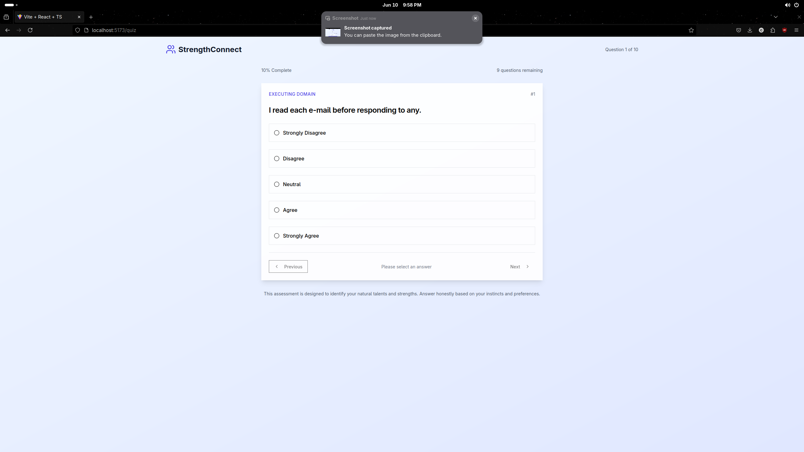

# System Design

## Use Case Diagrams & Descriptions

### ---

### ---

## ER Diagram & Descriptions

### ---

### ---

## Wireframes or Mockups

### Home Page


### Quiz Page


## Architecture Diagram

### Directory Structure
# Project Directory Structure

```
cop4813/
├── docs/               // Assignments
├── frontend/
│   ├── dist/               // Build dir, served by server.py
│   ├── node_modules/
│   ├── public/             // public files (images, videos, txt, json, etc...) compiled into bundle
│   ├── src/                       
│   │   ├── assets/                 // private files (images, videos, json, etc...) compiled into bundle
│   │   ├── components/             // Reusable react components 
│   │   ├── data/                   // Static Data compiled into bundle
│   │   ├── hooks/                  // React Hooks 
│   │   ├── lib/                    // Front-end libraries (e.g. utils)
│   │   ├── pages/                  // Front-end Pages
│   │   ├── types/                  // Front-end Types
│   │   ├── index.css           // Tailwind initializer
│   │   ├── main.tsx            // Main Router
│   ├── components.json         // Shadcn components 
│   ├── eslint.config.js        // Project lint rulse
│   ├── index.html              // Index page
│   ├── package-lock.json       // Npm pkg version manager
│   ├── package.json            // Npm pkg version manager
│   ├── postcss.config.js       // Tailwind Conf
│   ├── tailwind.config.js      // Tailwind Conf
│   ├── tsconfig.app.json       // Tailwind Conf
│   ├── tsconfig.json           // Typescript Conf
│   ├── tsconfig.node.json      // Typescript/Node Conf
│   └── vite.config.ts          // Vite Conf
├── README.md
├── requirements.txt    // Requirements for server
└── server.py           // Python server
```

### ---